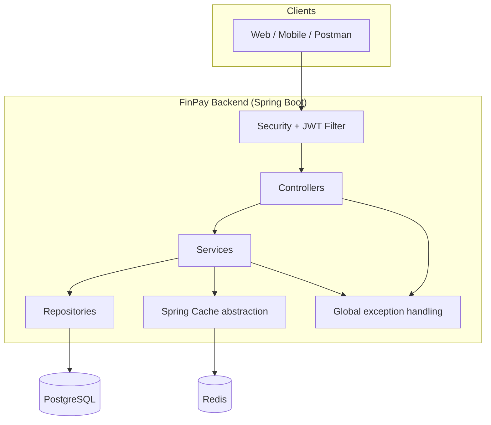
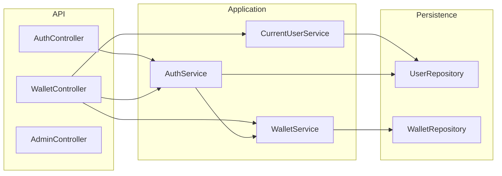
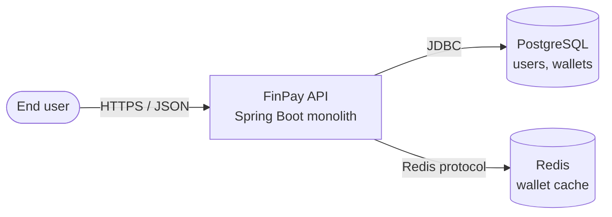
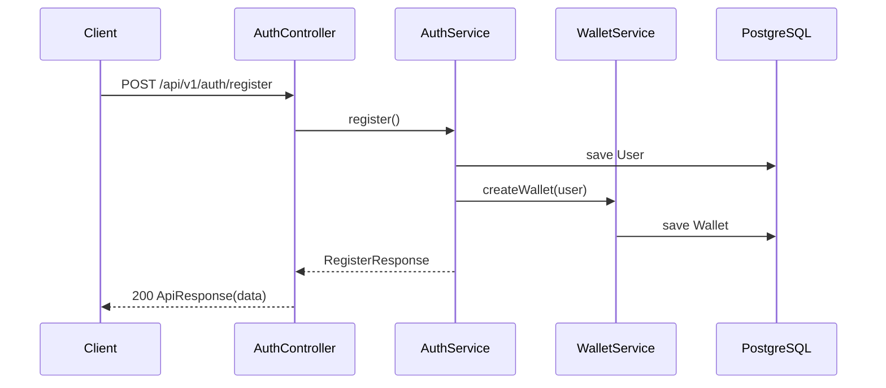
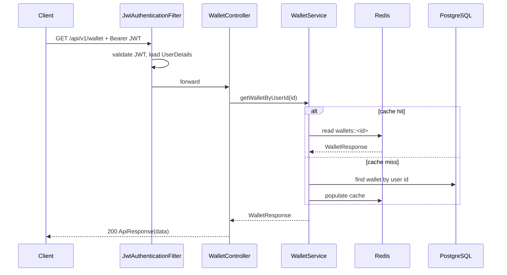
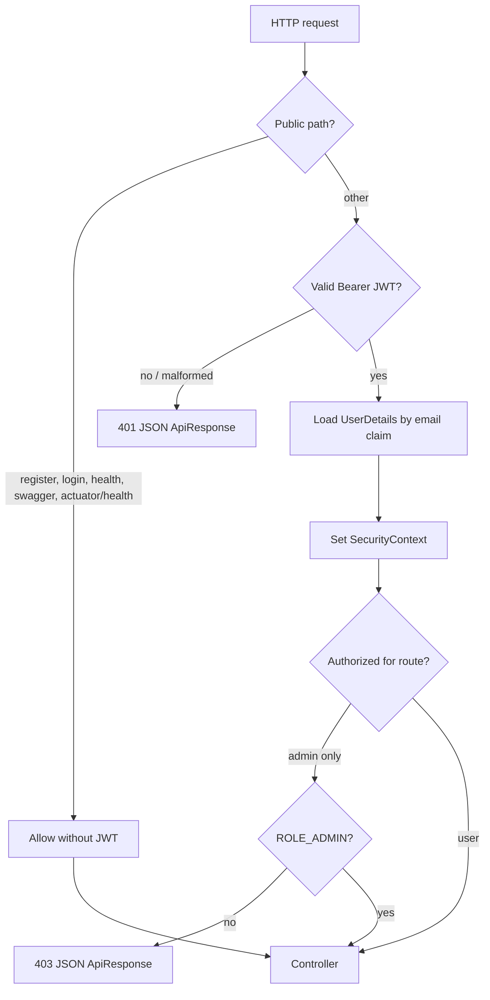

# FinPay Backend

Production-oriented **fintech wallet platform** backend: a **layered Spring Boot monolith** with **JWT authentication**, **RBAC**, **PostgreSQL**, **Redis-backed caching**, and **wallet** operations (credit, balance, KYC, transaction PIN storage).

> **Scope:** This repository implements **auth, wallet, and admin smoke APIs**. Features such as P2P transfers, Kafka, or an AI assistant are **not** part of the current codebase unless added in future work.

---

## Table of contents

1. [Architecture overview](#architecture-overview)  
2. [System context](#system-context)  
3. [Runtime & data flow](#runtime--data-flow)  
4. [Security architecture](#security-architecture)  
5. [Technology stack](#technology-stack)  
6. [API reference](#api-reference)  
7. [Setup & operations](#setup--operations)  
8. [Configuration & secrets](#configuration--secrets)  
9. [Testing](#testing)  
10. [Operational notes](#operational-notes)  
11. [Roadmap (optional extensions)](#roadmap-optional-extensions)  

---

## Architecture overview

FinPay follows a **classic layered architecture** inside a single deployable service. HTTP controllers delegate to application services; services orchestrate domain entities and persistence; cross-cutting concerns (security, caching, exceptions) live under `common`.



**Package layout (conceptual):**

| Layer | Packages | Responsibility |
|--------|-----------|----------------|
| **API** | `auth.controller`, `wallet.controller`, `admin.controller`, `common.controller` | HTTP mapping, validation triggers, response envelopes |
| **Application** | `auth.service`, `wallet.service` | Use cases: register, login, wallet credit, KYC, PIN |
| **Domain / persistence** | `auth.entity`, `wallet.entity`, `*.repository` | JPA entities, Spring Data repositories |
| **Infrastructure** | `common.config`, `common.security`, `common.exception` | Security filter chain, JWT, Redis cache manager, OpenAPI |



---

## System context



---

## Runtime & data flow

### Registration (transactional user + wallet)



### Authenticated wallet read (with cache)



### Credit wallet (transaction + optimistic locking + cache eviction)

Concurrent updates on the same wallet row can trigger an **optimistic lock conflict** (`409`); clients should **retry** the operation.

---

## Security architecture

### Principles

- **Stateless sessions:** `SessionCreationPolicy.STATELESS`; no server-side HTTP session for API auth.
- **JWT bearer tokens:** Issued at login; validated on each request in `JwtAuthenticationFilter`.
- **Passwords and PINs:** Stored using **BCrypt** (`PasswordEncoder`); never returned in API payloads.
- **RBAC:** `ROLE_USER` and `ROLE_ADMIN` via `CustomUserDetailsService` (`ROLE_` + enum name). Admin routes require `hasRole("ADMIN")`.
- **CSRF:** Disabled for stateless JWT APIs (typical for pure JSON APIs; pair with HTTPS and CORS policy at the edge in production).

### Request security flow



### Public vs protected paths (high level)

| Pattern | Access |
|---------|--------|
| `POST /api/v1/auth/register`, `POST /api/v1/auth/login` | Public |
| `GET /health`, `GET /actuator/health` | Public |
| `/v3/api-docs/**`, `/swagger-ui/**`, `/swagger-ui.html` | Public (restrict in hardened prod if needed) |
| `GET /api/v1/admin/**` | `ROLE_ADMIN` only |
| All other routes (e.g. `/api/v1/wallet/**`, `/api/v1/test`) | Authenticated user |

### Hardening checklist for real production

- Set **`JWT_SECRET`** (long, random; rotate with a process).
- Use **TLS termination** (ingress, API gateway, or reverse proxy).
- Replace **`ddl-auto: update`** with **Flyway/Liquibase**; turn off **`show-sql`** in prod.
- Restrict **Swagger** exposure or protect it behind auth/VPN.
- Add **rate limiting** on login and financial endpoints; enforce **transaction PIN** on debits/credits if required by policy.
- Centralize **logging** (structured JSON), **metrics**, and **tracing** (e.g. OpenTelemetry).

---

## Technology stack

| Component | Choice |
|-----------|--------|
| Runtime | **Java 21** |
| Framework | **Spring Boot 3.5.x** |
| Security | **Spring Security** + **JJWT** |
| API docs | **springdoc-openapi** 2.x (`/swagger-ui`) |
| Persistence | **Spring Data JPA** / **Hibernate** + **PostgreSQL** |
| Cache | **Spring Cache** + **Redis** (`spring.cache.type=redis`) |
| Validation | **Jakarta Bean Validation** |
| Build | **Maven** (`mvnw`) |
| Local infra | **Docker Compose** (Postgres 16, Redis 7) |

---

## API reference

### Response envelope

All controllers use a consistent JSON envelope:

```json
{
  "success": true,
  "message": "OK",
  "data": { },
  "timestamp": "2026-05-10T12:00:00"
}
```

Errors from `@RestControllerAdvice` use `success: false` and an appropriate HTTP status. Validation failures return `message: "Validation failed"` and `data` as a map of field → error message.

### Authentication

After login, send:

```http
Authorization: Bearer <jwt>
```

OpenAPI UI: **`http://localhost:8080/swagger-ui/index.html`** (with the app running).

### Endpoints summary

| Method | Path | Auth | Description |
|--------|------|------|-------------|
| `POST` | `/api/v1/auth/register` | Public | Create user + wallet |
| `POST` | `/api/v1/auth/login` | Public | Returns JWT in `data.token` |
| `GET` | `/api/v1/wallet` | User | Wallet details (`data`: wallet DTO) |
| `GET` | `/api/v1/wallet/balance` | User | Balance (`data.balance`) |
| `POST` | `/api/v1/wallet/credit` | User | Credit wallet (`data`: wallet DTO) |
| `PUT` | `/api/v1/wallet/set-pin` | User | Set hashed transaction PIN |
| `PUT` | `/api/v1/wallet/complete-kyc` | User | Submit KYC fields; marks user verified |
| `GET` | `/api/v1/admin/test` | Admin | Smoke test for admin role |
| `GET` | `/api/v1/test` | User | Protected smoke test |
| `GET` | `/health` | Public | Liveness message |
| `GET` | `/actuator/health` | Public | Spring Boot health |

### Example requests

**Register**

```http
POST /api/v1/auth/register
Content-Type: application/json

{
  "name": "Ada Lovelace",
  "email": "ada@example.com",
  "password": "change-me"
}
```

**Login**

```http
POST /api/v1/auth/login
Content-Type: application/json

{
  "email": "ada@example.com",
  "password": "change-me"
}
```

**Credit wallet**

```http
POST /api/v1/wallet/credit
Authorization: Bearer <jwt>
Content-Type: application/json

{
  "amount": 100.50
}
```

`amount` must satisfy server validation (min **0.01**, max **999999999.99**, up to **2** decimal places).

---

## Setup & operations

### Prerequisites

- **JDK 21**
- **Docker** (recommended for Postgres + Redis)
- **Maven** (or use the included **`mvnw`** wrapper)

### 1. Start infrastructure

From the repository root:

```bash
docker compose -f docker/docker-compose.yml up -d
```

This starts:

- **PostgreSQL** on `localhost:5432`, database `finpay`
- **Redis** on `localhost:6379`

### 2. Run the application

```bash
cd backend
./mvnw spring-boot-run
```

On Windows (PowerShell):

```powershell
cd backend
.\mvnw.cmd spring-boot-run
```

Default URL: **`http://localhost:8080`**

### 3. Verify

```bash
curl http://localhost:8080/health
curl http://localhost:8080/actuator/health
```

---

## Configuration & secrets

Key settings live in **`backend/src/main/resources/application.yaml`**.

| Variable | Purpose | Notes |
|----------|---------|--------|
| `SPRING_DATASOURCE_URL` | JDBC URL | Defaults to local `finpay` DB |
| `SPRING_DATASOURCE_USERNAME` / `SPRING_DATASOURCE_PASSWORD` | DB credentials | **Required** in production |
| `SPRING_DATA_REDIS_HOST` / `SPRING_DATA_REDIS_PORT` | Redis | Default `localhost:6379` |
| `JWT_SECRET` | HMAC key for JWT | **Must** be strong in production |
| `JWT_EXPIRATION` | Token TTL (ms) | Default `3600000` (1 hour) |

Example (PowerShell):

```powershell
$env:JWT_SECRET="<long-random-secret>"
$env:SPRING_DATASOURCE_PASSWORD="<secure-password>"
cd backend; .\mvnw.cmd spring-boot-run
```

---

## Testing

- **Default integration test** uses profile **`test`**: in-memory **H2**, **simple** cache, **Redis auto-config disabled** (see `backend/src/test/resources/application-test.yaml`).
- Run:

```bash
cd backend
./mvnw test
```

Full stack tests against real Postgres/Redis are not required for `contextLoads` but should be part of your CI strategy for release candidates.

---

## Operational notes

- **Caching:** Cache names **`wallets`** and **`walletBalance`** are backed by Redis in the default profile; entries are evicted on wallet credit and on KYC/PIN updates affecting displayed wallet data.
- **Optimistic locking:** Wallet entity uses **`@Version`**; conflicting parallel updates return **HTTP 409** with a retry-oriented message.
- **Time zone:** The application sets the default JVM time zone to **Asia/Kolkata** in `BackendApplication`; ensure DB session timezone policy matches your compliance needs.

---

## Roadmap (optional extensions)

- P2P **transfer engine** with ledger / idempotency keys  
- **Kafka** for domain events and async integrations  
- **AI** or rules-based assistance as a separate BFF or service  
- **Flyway** migrations, **secret manager**, and **zero-trust** network policies  

---

## License

See project metadata (e.g. `OpenAPI` **MIT** reference in `OpenApiConfig`) or add a root `LICENSE` file to match your organization.

---

## Maintainer

API metadata lists **Aditya Sinha** as contact in `OpenApiConfig`; update as appropriate for your fork.
